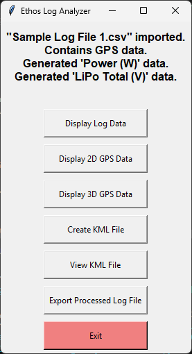
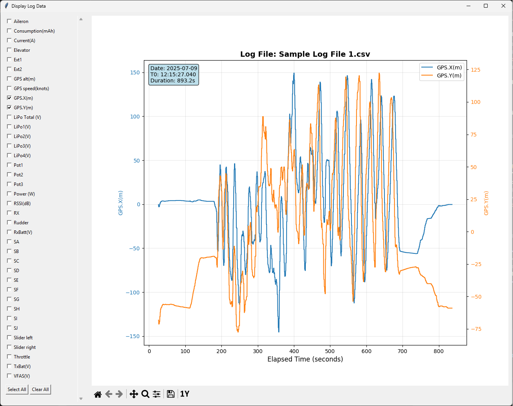
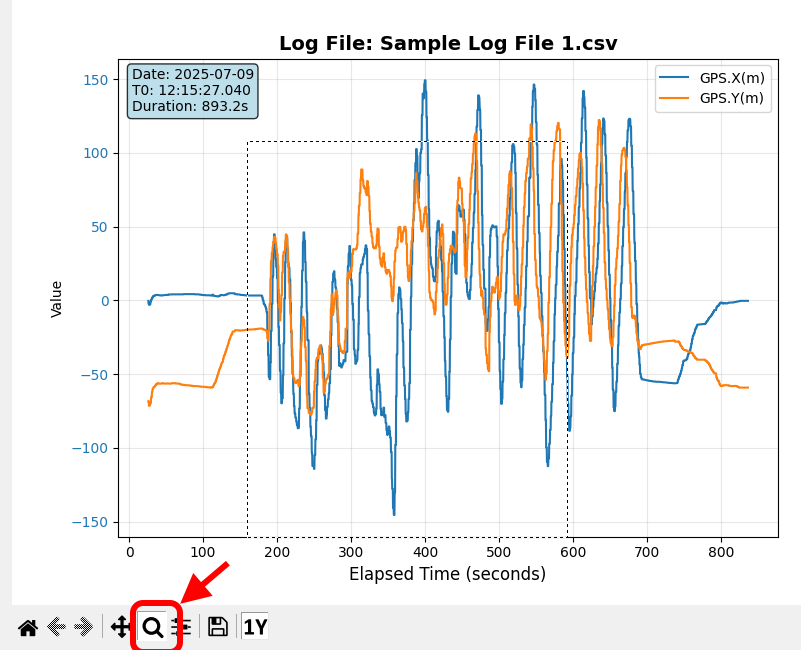
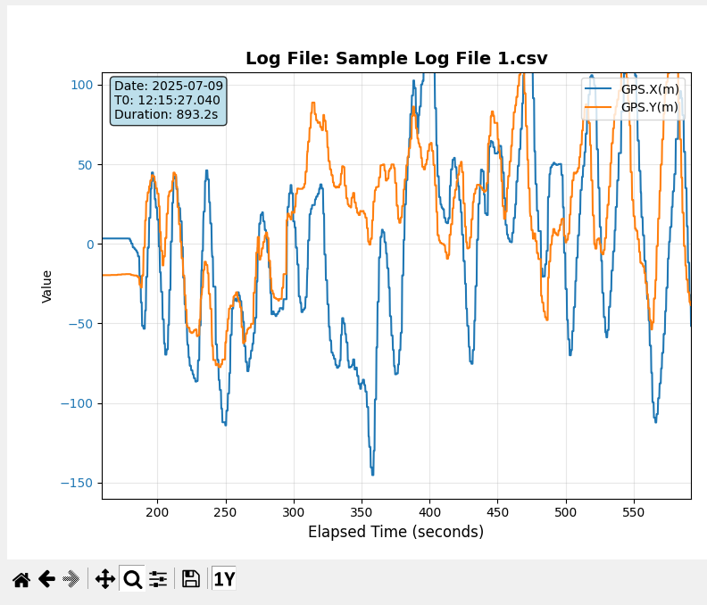
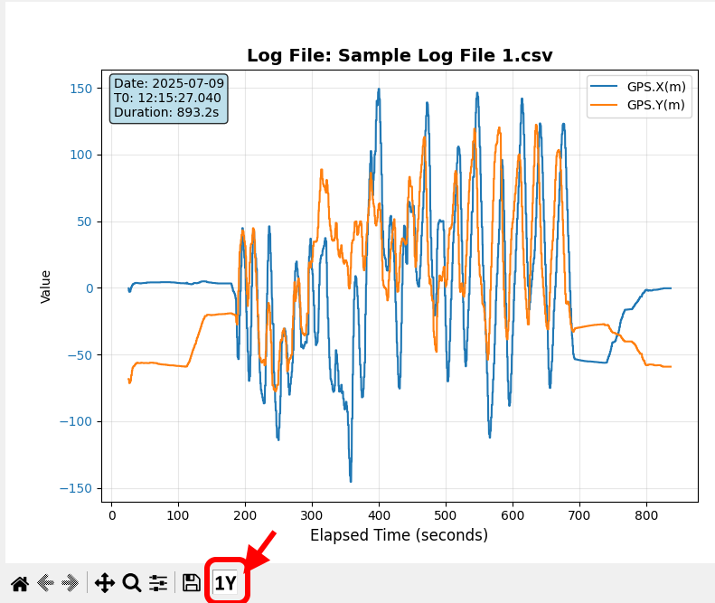
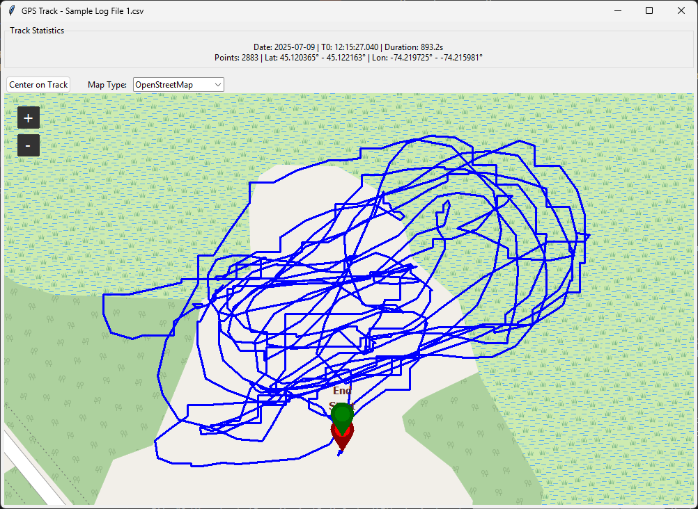
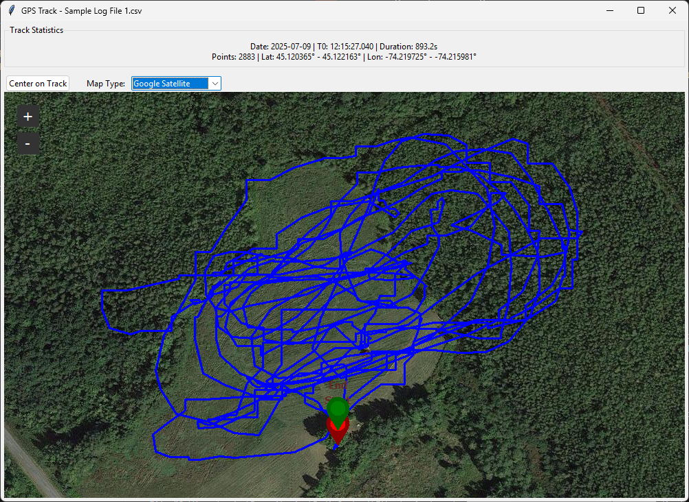
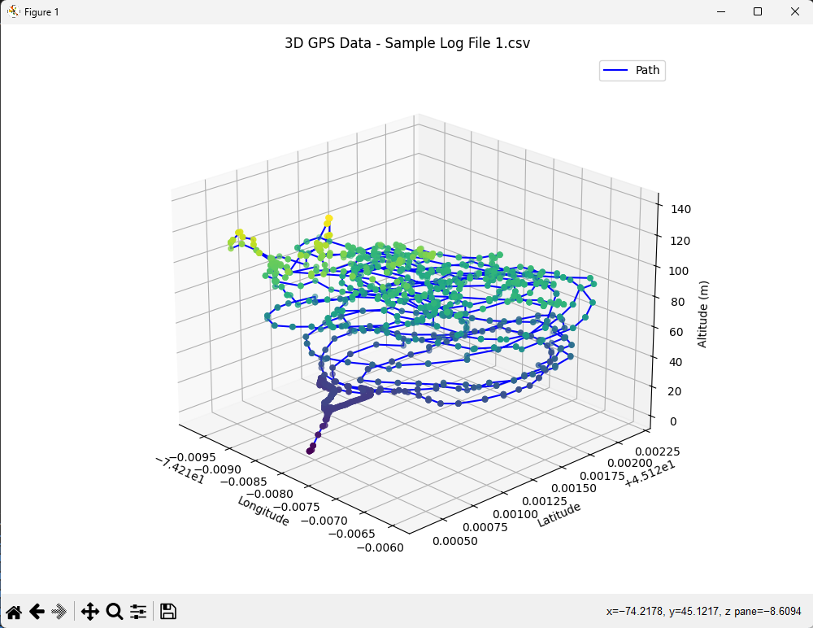

# Ethos Log Analyzer

## Overview

Ethos Log Analyzer is a Python application designed to analyze and visualize files recorded by FrSky radio control transmitters using the Ethos operating system. The log files are in CSV format and contain telemetry data such as GPS coordinates, battery voltage, current, and other flight parameters. It provides an interface for loading log files and performing various actions such as displaying the data and generating KML files.

## Features

- Load CSV log files
- Display log data in a structured format
- Visualize 2D and 3D GPS data
- Create and view KML files for mapping

## Requirements

To run this application, you need to have the following Python packages installed:

- pandas
- matplotlib
- tkintermapview
- pyproj
- numpy

You can install the required packages using pip. See the `requirements.txt` file for the complete list of dependencies.

## Installation

1. Clone the repository:
   
   ```
   git clone <repository-url>
   ```

2. Navigate to the project directory:
   
   ```
   cd EthosLogAnalyzer
   ```

3. Install the required packages:
   
   ```
   pip install -r requirements.txt
   ```

## Usage

To run the application, execute the `main.py` file:

```
python src/main.py
```

Follow the prompts to load a CSV file and use the provided buttons to perform various actions.

### Main Menu

Once the selected data file has been imported a dialog box with available functions is displayed. If the file did not contain GPS data then any functions involving that data (including anything to do with kml files) will be disabled.


The available data is a function of what was contained in the original log file. A few notes on this:

- Any data series (columns) in the log file containing no valid data are removed
- The GPS data series in an Ethos log file contains both the latitude and longitude data in a single string. This application splits the string into two series "GPS.Latitude" and "GPS.Longitude" during the import process.
- If the "GPS.Latitude" and "GPS.Longitude" data series are created, then two new series "GPS.X(m)" and "GPS.Y(m)" are generated as X and Y offsets, in metres, relative to the center of the GPS data. WGS84 is used for the map projection.
- If the log file contains series such as "LiPo1(V)", "LiPo2(V)", etc., then a new series "LiPo Total(V)" is calculated as the sum of the individual LiPo cell values.
- If the log file contains data series "VFAS(V)" and "Current(A)" than a new series "Power(W)" is generated as the product of the voltage and current values.

### Display Log Data

This function supports the display of one or more data series on the y axis against elapsed time on the X axis.  The available data may be selected through a series of check boxes down the left side of the window. 



If one, two, or three data series are selected then each series will have its own y axis scale. If more than three series are selected then they will use a common y axis scale. The X axis "Elapsed Time" is computed during the import as an offset from the time value in the first row of data.

A navigation toolbar is displayed along the bottom of the plot. It includes all of the standard matplotlib navigation toolbar functionality. 


The toolbar can be used to zoom in on a region by selecting with the mouse:


When the mouse buttomn is released the zoomed-in region will be displayed:


A button "1Y" has been added to the toolbar to force the use of a single Y axis scale, even with two or three selected data series:


### Display 2D GPS Data

Provided that "GPS.Latitude" and "GPS.Longitude" columns exist in the data after import, this function displays the GPS track over a terrain image of the geographic area. Zoom + and - buttons are provided.

The terrain image can be Open Street Map:



Google satellite imagery can also be selected:



### Display 3D GPS Data

Provided that "GPS.Latitude", "GPS.Longitude", and "GPS alt(m)" columns exist in the data after import, this function displays the GPS track as a 3D plot. The plot can be rotated using the mouse. 



### Create KML File

Provided that "GPS.Latitude" and "GPS.Longitude" columns exist in the data after import, this function exports a kml file containing the GPS data. If there is a "GPS alt(m)" column it will be included in the kml file for altitude. This file can be opened in an application such as Google Earth. 

### View KML File

This function uses the "Create KML File" function to export a file "temp.kml" containing the GPS data. It then requests the OS to open that file. Assuming the OS has been configured to open kml files (e.g. by installing an application such as Google Earth) you will see the GPS track. 

## License

This project is licensed under the MIT License. See the LICENSE file for details.